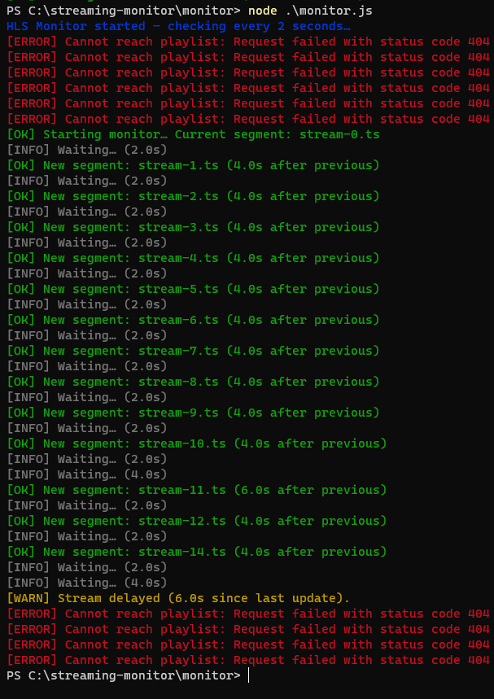

# Live Stream Health Monitor (Node.js)

A lightweight real-time monitoring tool that evaluates the health of an HLS live stream by reading its `.m3u8` playlist, detecting segment delays, freezes, and output failures. Built to mimic the kind of basic telemetry and incident-detection tooling used in Live Operations for large-scale broadcast streaming.

---

## 🚀 Features

- Polls an HLS playlist at a fixed interval (default: 2 seconds)
- Extracts the latest `.ts` segment
- Detects and logs:
  - 🟢 New segments (healthy)
  - 🟡 Segment delays
  - 🔴 Stream freezes
  - ❌ Playlist/network failures
- Color‑coded terminal output
- Works seamlessly with Project 1 (OBS → RTMP → NGINX → HLS pipeline)

---

## 📂 Project Structure

```
monitor/
  monitor.js
  package.json
  assets/
    monitor_output.png   (add manually)
```

---

## 📦 Installation

Inside the `monitor/` directory:

```bash
npm install axios chalk
```

---

## ▶️ Running the Monitor

Ensure your streaming pipeline is active:

```
OBS → RTMP → NGINX → HLS
```

Run the monitor:

```bash
node monitor.js
```

Expected example output:

```
HLS Monitor started — checking every 2 seconds…
[OK] Initial segment: stream-220.ts
[OK] New segment: stream-221.ts (4.1s after previous)
[INFO] Waiting… (2.0s)
[WARN] Stream delayed (6.2s)
[ERROR] Stream frozen! No new segments for 12.4s.
```

---

## 🖼 Screenshot




Create an `assets/` folder and place your screenshot inside it as `monitor_output.png`.

---

## ⚙️ How It Works

1. Fetches the HLS playlist (`stream.m3u8`)
2. Parses `.ts` segment entries
3. Tracks the latest segment + last update time
4. Calculates segment age
5. Determines status:
   - < 5s → info
   - 5–10s → warning
   - > 10s → error
6. Logs meaningful health information

This simulates simplified internal monitoring behavior used in real live broadcast operations.

---

## 📄 Configuration

Playlist URL:

```js
const PLAYLIST_URL = "http://localhost:8080/hls/stream.m3u8";
```

Polling interval:

```js
setInterval(checkStream, 2000);
```

Thresholds:

```js
if (ageSec >= 10) { ... }   // frozen
else if (ageSec >= 5) { ... } // delayed
```

---

## 🧪 Failure Simulation

- Stop OBS streaming → freeze detection  
- Throttle your network → playlist fetch failure  
- Change segment duration → threshold shift  
- Restart encoder mid-stream → rapid state changes  

---

## 📝 Summary

This project delivers:

- A functional livestream health checker  
- Insight into encoder or CDN issues  
- Understanding of live-stream operational behavior  
- Strong relevance for Live Ops or Media Engineering roles  

Pairs with **Project 1: RTMP → HLS Pipeline** for a complete live-stream ecosystem.

---

## 📜 License

MIT License. See `LICENSE` for details.
